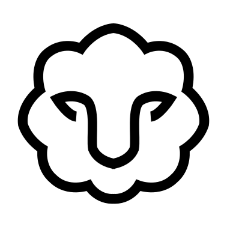

<div align="center">

</div>

# smala

A simple memory-aided language assistant.


## Quickstart


Clone repository:

```
git clone https://github.com/ejhusom/smala
```

Create and activate a virtual environment (optional):

```
mkdir venv
python3 -m venv venv
source venv/bin/activate
```

Install requirements:

```
pip3 install -r requirements.txt
```

Update `config/settings.yaml` with your desired setup.

Run smala:

```
python3 src/smala.py
```


## About

The inspiration for smala came from the [Memory](https://openai.com/index/memory-and-new-controls-for-chatgpt/) feature of ChatGPT, where the chatbot will remember important pieces of information across your conversations.
I wanted to make something with similar functionality that is independent of what service or language model you use.
This flexibility, together with control and transparency, are the founding principles of smala.
You control your own data, using any language model you like.
smala is designed to be transparent by making it easy to control all instructions given to the language model with respect to how it extracts and uses memories.


<!-- ## Tests -->

<!-- ``` -->
<!-- pytest tests/ -->
<!-- ``` -->

