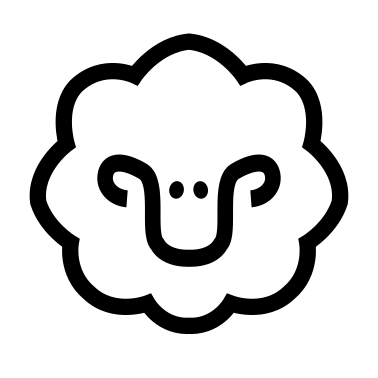

<div align="center">

</div>

# smala

A simple memory-aided language assistant.

Chat with any local language model, and let smala help you by storing essential information across conversations.

- [What does smala do?](#what-does-smala-do)
- [Quickstart](#quickstart)
- [How does smala work?](#how-does-smala-work)
- [About](#about)

## What does smala do?

When you chat with a language model through smala, you can make the tool "remember" certain information ("memories"), either by giving an explicit instruction (`/remember`), or by letting smala automatically summarize your conversation. These "memories" will then be available in later chats through smala, whatever language model you choose to use.

smala works with any language model used through [Ollama](https://ollama.com/), and lets you build (automatically or manually) your own archive of memories that you want the language model to use while chatting with it.

The smala tool is designed around the following principles:

- **Privacy**: Works with local models, enabling you to freely use personal and sensitive information without worrying about data collection.
- **Flexibility**: Use any open-weights language model that is available through Ollama, and swap between them without losing any information.
- **Control**: Customize the instructions given to the model on how to extract and use memories. Easily add and remove memories.

## Quickstart

You need to have [Ollama](https://ollama.com/) installed, and download the language model(s) you want to use (Ollama provides a large number of models).

Clone repository:

```bash
git clone https://github.com/ejhusom/smala
```

Create and activate a virtual environment (optional):

```bash
mkdir venv
python3 -m venv venv
source venv/bin/activate
```

Install requirements:

```bash
pip3 install -r requirements.txt
```

Update `config/settings.yaml` with your desired setup, most importantly which language model you want to use (make sure you have it installed through Ollama).

Run smala:

```bash
python3 src/smala.py
```

The following prompt will appear, and you can start chatting:

```bash
Welcome to the Local LLM Assistant!
Type '"""' to start multi-line input mode.
Type '/remember' as part of a prompt to store a summary of it, or type only '/remember' to save a summary of the last prompt.
Type '/exit' to quit. On exit, you will be asked whether a summary of the conversation should be saved as a 'memory'.
>>>
```

## How does smala work?


smala lets you chat with an LLM, but unlike other tools, it will automatically summarize your conversations and save those summaries as memories.
You may also tell smala explicitly to remember certain pieces of information, by using the `/remember` command.

Automatic creation of memories during the conversations is a planned feature, as indicated by the faded box in the diagram above.

The sequence diagram below illustrates how smala works.


## About

The inspiration for smala came from the [Memory](https://openai.com/index/memory-and-new-controls-for-chatgpt/) feature of ChatGPT, where the chatbot will remember important pieces of information across your conversations.
I wanted to make something with similar functionality that is independent of what service or language model you use.

This flexibility, together with privacy and control, are the founding principles of smala.
You own your data, using any available language model you like.
smala is designed to be transparent by making it easy to customize all instructions given to the language model with respect to how it extracts and uses memories.


<!-- ## Tests -->

<!-- ``` -->
<!-- pytest tests/ -->
<!-- ``` -->

